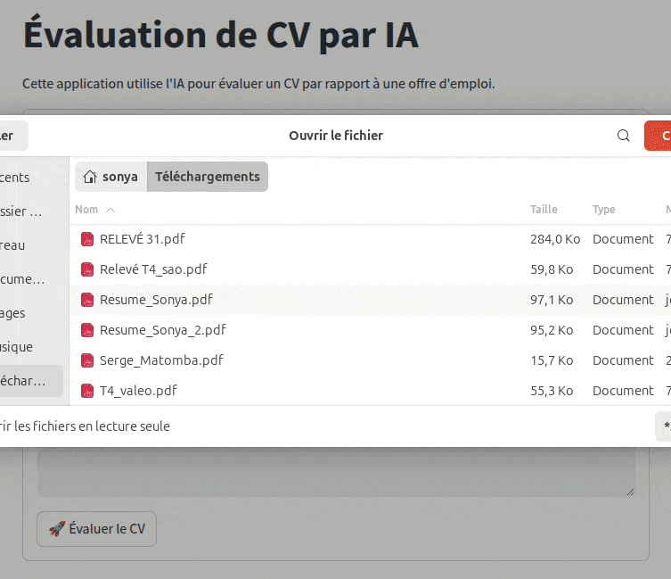

## CV Evaluation System using LLaMA-3.3-70B-Versatile


This project is a **CV evaluation system** that leverages the **LLaMA-3.3-70B-Versatile** model, combined with advanced **prompt engineering techniques**, to analyze and evaluate resumes based on a specific job offer. The system compares the CV to the job description, identifies matches, gaps, and areas for improvement, and provides detailed feedback to help recruiters or hiring managers make informed decisions.

---

## Demo


*Example of the CV evaluation system in action, comparing a CV to a job offer.*

---

## Features

- **Job Offer Comparison**: Evaluate a CV against a specific job description to determine relevance.
- **Detailed Feedback**:
  - **Positive Points**: Skills and experiences that match the job requirements.
  - **Negative Points**: Aspects of the CV that do not align with the job offer.
  - **Missing Points**: Key skills or experiences that are absent but required for the job.
- **LLM-Powered Evaluation**: Use the **LLaMA-3.3-70B-Versatile** model with custom prompts to ensure accurate and context-aware evaluations.
- **Prompt Engineering**: Advanced prompt design to guide the model's analysis and feedback generation.


## Installation

1. **Clone the repository**:
   ```bash
   git clone https://github.com/SonyaGankam/cv-evaluation-llm.git
   cd cv-evaluation-llm

2. **Install dependencies**:

pip install -r requirements.txt

Set up the LLaMA model:

Download or configure the LLaMA-3.3-70B-Versatile model. Follow the instructions provided by the model's repository or documentation.

Ensure the model is accessible in your environment (e.g., via API or local deployment


   
